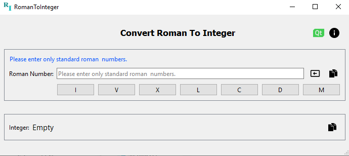

# Roman To Integer Converter
This program is created with Python and PyQt.  
It converts Roman numerals to integers quickly and easily.

### Features
- Convert any valid Roman numeral to integer
- User-friendly interface
- Works smoothly and efficiently
- Easy to use for beginners and advanced users

## Screenshots

Python Website: https://www.python.org/  
Qt Website: https://www.qt.io/  

## License
CC License: Roman To Integer © 2024 by Gm is licensed under CC BY-SA 4.0
